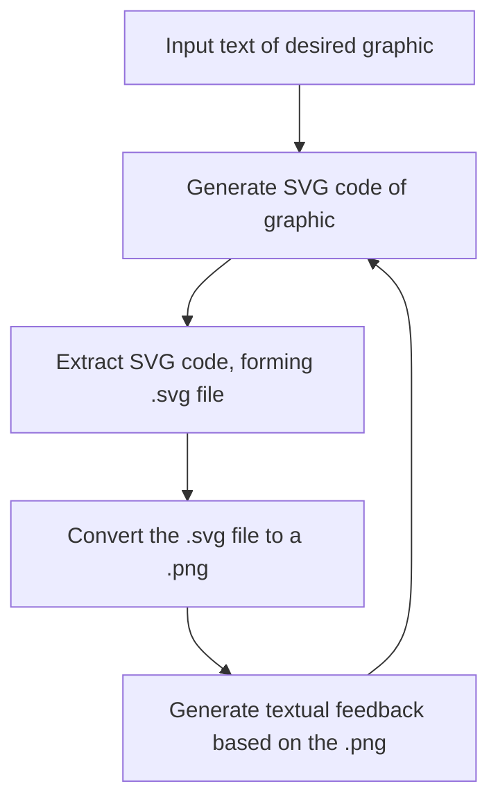

# Vector Graphic Generator

## About
A simplified script that was developed as part of a Summer Research Project. It introduces the novel idea of a feedback loop to improve AI vector graphic generation. By incorporating an iterative component, the script significantly improves the process of generating vector graphics. In essence, it:

1. We first receive a string input of what the desired graphic is.
2. **Repeat steps 3 - 6 for `x` iterations**
3. Based on the textual description provided, a model such as GPT-4 is then used to generate the corresponding SVG code.
4. We then take the output, and extract the text between the first `<svg>` tag and the last `</svg>`. We then save this as an `.svg` file.
5. Following, we then convert this `.svg` file to a `.png` file, converting the vector graphic to a raster graphic. This step leverages the advanced multimodal capabilities of GPT models.
6. The raster graphic is then passed into a model that accepts image inputs, such as GPT-4 Vision, where it then evaluates and issues feedback on one thing that needs to be improved.

## GIF Demonstrations

  
  

## Acknowledgements
This project would not have been possible without the support of my supervisors:
* Professor Michael Witbrock, and 
* Dr. Trung Nguyen

## To setup OpenAI's API
Add in the file `config.py` located in the root directory, your API key.

## Usage
Upon running the script, the user will be prompted in the terminal to:

* Specify what they want to generate.
* Enter the number of iterations they wish for the script to run.

The output of the generation will be saved into the folders `svg-output` and `png-output`, which are contained in the root directory. Additionally, after every iteration, a probability rating of how similar the generated graphic is to the text input is provided, utilisng OpenAI's CLIP model.
